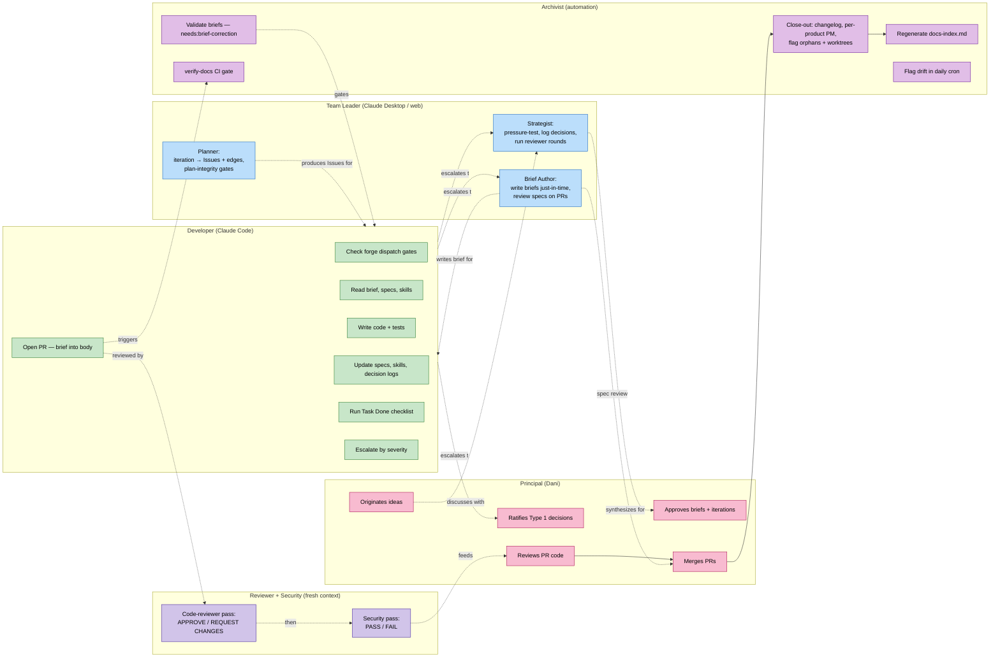
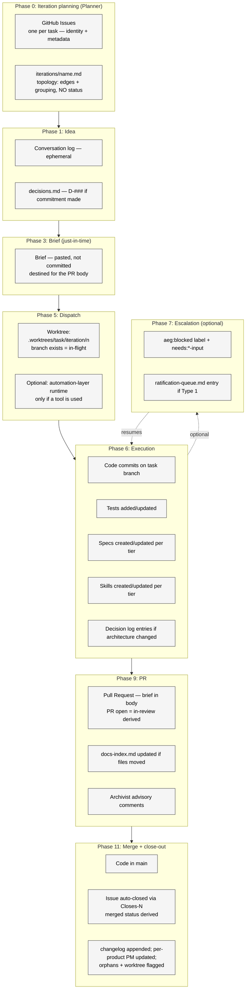
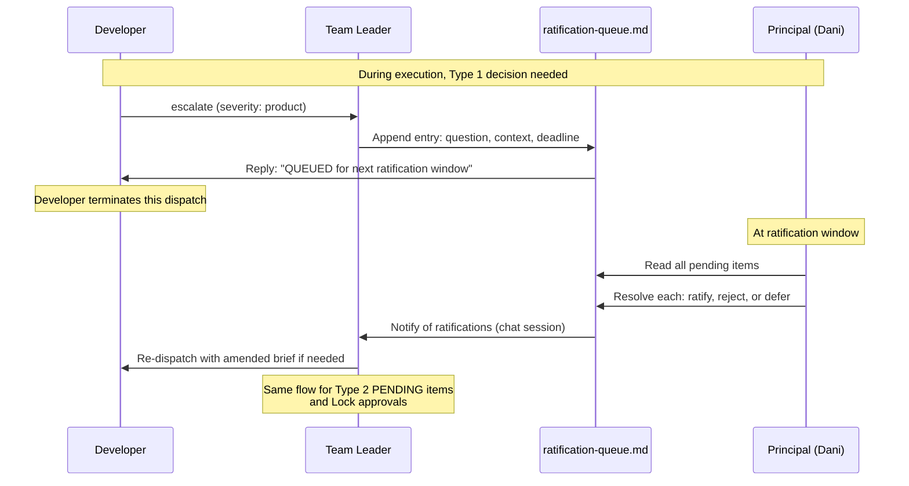
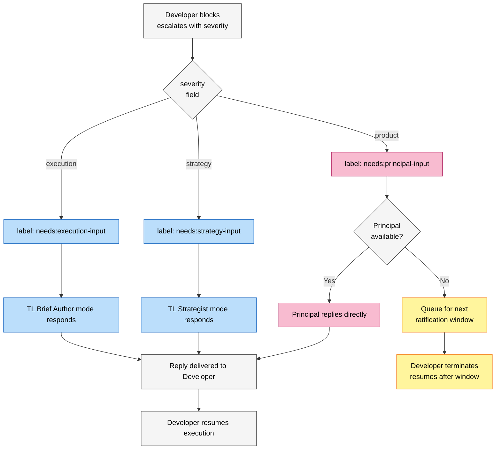
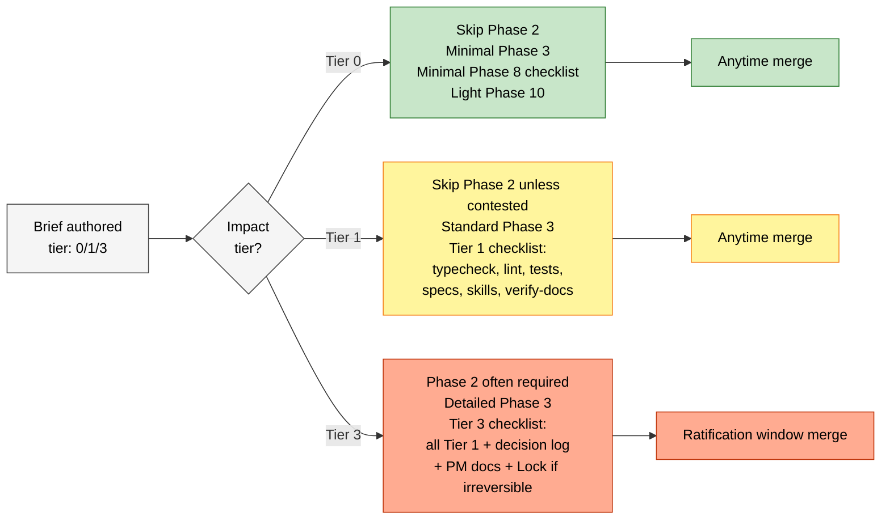

# Process flow diagram

Visual representation of the AEG workflow described in `process.md`. Shows actors, artifacts, gates, and decision points.

For the prose walkthrough, see `process.md`. For the optional orchestration tool's software architecture, see `system-architecture.md`.

> **Status is derived, never stored.** These diagrams show transitions as *forge facts* (Issue assigned, branch exists, PR open, review decision, merged) — not as status labels anyone writes. Where a diagram and the prose docs disagree, the prose is canonical.

---

## High-level flow

```mermaid
flowchart TD
    Start([Dani has an idea]) --> P0[Phase 0: Iteration planning<br/>TL Planner mode → Issues + thin topology file]

    P0 --> P1[Phase 1: Idea origination<br/>Principal + TL Strategist mode]

    P1 --> P1Decision{Idea worth<br/>pursuing?}
    P1Decision -->|No / already specced| End1([End: idea dies])
    P1Decision -->|Yes, high-stakes| P2[Phase 2: Pressure-testing<br/>TL + external reviewers]
    P1Decision -->|Yes, normal stakes| P3

    P2 --> P2Decision{Direction<br/>holds?}
    P2Decision -->|Structural flaw| P1
    P2Decision -->|Validated| P3[Phase 3: Brief authoring just-in-time<br/>TL Brief Author mode]

    P3 --> P3Out[/Brief written, pasted to Developer<br/>lands in PR body — never in the Issue/]
    P3Out --> P4[Phase 4: Brief validation<br/>Archivist gate + Developer entry gate]

    P4 --> P4Decision{Brief<br/>well-formed?}
    P4Decision -->|No| P4Block[/needs:brief-correction<br/>back to Brief Author/]
    P4Block --> P3
    P4Decision -->|Yes| P5[Phase 5: Dispatch<br/>Principal — manual paste or automation layer]

    P5 --> P5Gate{Dispatch gates<br/>clear?}
    P5Gate -->|depends-on not merged,<br/>or conflict PR open| P5Wait[/Serialize — wait/]
    P5Gate -->|clear| P5Out[/Worktree task/iteration/n created<br/>branch exists = in-flight/]
    P5Out --> P6[Phase 6: Execution<br/>Developer in worktree]

    P6 --> P6Decision{Blocked on<br/>decision?}
    P6Decision -->|Yes| P7[Phase 7: Escalation<br/>escalation mechanism + severity]
    P6Decision -->|No| P8[Phase 8: Task Done verification<br/>Developer runs checklist + verify-docs]

    P7 --> P7Route{Severity<br/>routing}
    P7Route -->|execution| P7TL[TL Brief Author replies]
    P7Route -->|strategy| P7TLStrat[TL Strategist replies]
    P7Route -->|product| P7Princ[Principal replies<br/>or queues for ratification window]
    P7TL --> P6
    P7TLStrat --> P6
    P7Princ --> P6

    P8 --> P8Decision{All checks<br/>pass?}
    P8Decision -->|No| P6
    P8Decision -->|Yes| P9[Phase 9: PR opened<br/>brief into PR body = in-review derived]

    P9 --> P9Out[/CI runs verify-docs<br/>Archivist posts advisory comments/]
    P9Out --> P10A[Phase 10a: code-reviewer pass<br/>then security pass — fresh context]

    P10A --> P10ADecision{Verdicts<br/>clean?}
    P10ADecision -->|BLOCKER / CRITICAL / HIGH| P6
    P10ADecision -->|APPROVE / PASS| P10B[Phase 10b: Principal code review<br/>+ TL spec review]

    P10B --> P10Decision{Reviews<br/>pass?}
    P10Decision -->|Issues found| P6
    P10Decision -->|All pass| P11[Phase 11: Merge<br/>Principal — Tier 3 at ratification window]

    P11 --> P11Out[/Merge auto-closes Issue Closes-N<br/>merged status derived<br/>Archivist close-out/]
    P11Out --> End2([End: work shipped])

    classDef tlStrat fill:#bbdefb,stroke:#1565c0,color:#000
    classDef tlPlan fill:#b3e5fc,stroke:#0277bd,color:#000
    classDef tlBriefDispatch fill:#ffe0b2,stroke:#e65100,color:#000
    classDef archivist fill:#e1bee7,stroke:#6a1b9a,color:#000
    classDef developer fill:#c8e6c9,stroke:#2e7d32,color:#000
    classDef escalation fill:#fff59d,stroke:#f57f17,color:#000
    classDef reviewer fill:#d1c4e9,stroke:#4527a0,color:#000
    classDef principalReview fill:#f8bbd0,stroke:#ad1457,color:#000
    classDef terminus fill:#cfd8dc,stroke:#455a64,color:#000
    classDef gate fill:#ffccbc,stroke:#bf360c,color:#000

    class P1,P2 tlStrat
    class P0 tlPlan
    class P3,P5 tlBriefDispatch
    class P4,P4Block archivist
    class P6,P8,P9,P9Out,P5Out,P3Out,P11Out developer
    class P7,P7TL,P7TLStrat,P7Princ escalation
    class P10A reviewer
    class P10B,P11 principalReview
    class Start,End1,End2,P5Wait terminus
    class P1Decision,P2Decision,P4Decision,P5Gate,P6Decision,P7Route,P8Decision,P10ADecision,P10Decision gate
```

**Color coding:**
- Light blue: TL Planner mode — decomposing an iteration into Issues + edges
- Blue: TL Strategist mode — thinking, pressure-testing
- Orange: TL Brief Author mode + Principal dispatch — formalization
- Purple: Archivist (validation gate, close-out, advisory)
- Green: Developer work + artifacts produced during execution
- Yellow: Escalation routing
- Deep purple: Reviewer + Security passes (fresh context)
- Pink: Principal + TL review and merge
- Grey: Start/end/wait states
- Salmon: Decision gates

---

## Actor responsibilities by phase

---

## Artifact lifecycle

What gets created or mutated as work flows through the phases. **No status is written** — status is derived from the forge facts shown.

---

## Ratification window flow

How Type 1 decisions, Tier 3 merges, and Lock approvals batch through governance windows.

---

## Severity routing

How escalations route based on severity. (The escalation mechanism is manual, or an automation layer's request-input — the routing is identical either way.)

---

## Tier-driven gating

Which gates apply depending on impact tier.

---

## How to read these diagrams

- **High-level flow** — the canonical map of work. Find where a piece of work is.
- **Actor responsibilities** — who does what; your role determines which boxes are yours.
- **Artifact lifecycle** — what gets created when; note status is derived, never an artifact.
- **Ratification window flow** — governance cadence for Tier 3 / Type 1.
- **Severity routing** — what happens when a Developer blocks.
- **Tier-driven gating** — what discipline applies to a given task.

---

## Diagrams are documentation

These diagrams are part of the canonical operational model. Updates to the process require updating both `process.md` and these diagrams in the same PR. Out-of-sync diagrams are spec drift. Where a diagram and the prose disagree, the prose (`process.md`, `iterations/README.md`, `state-machine.md`) is canonical.
