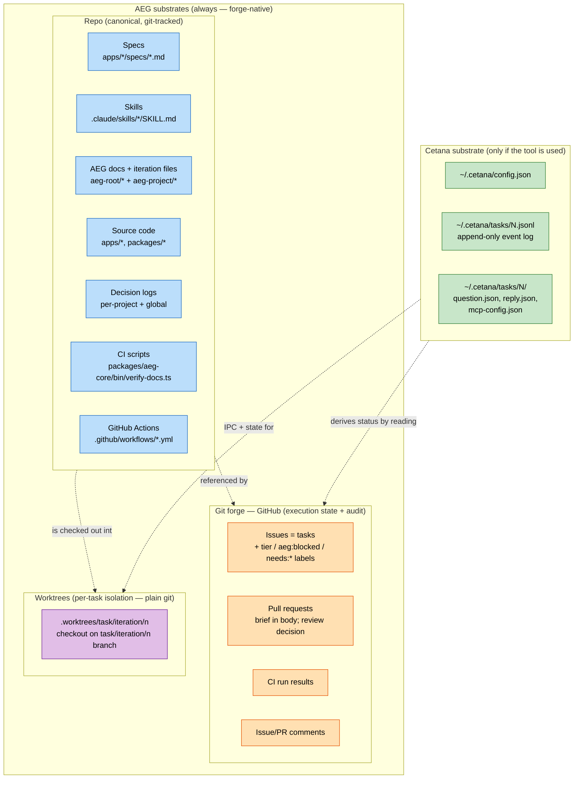
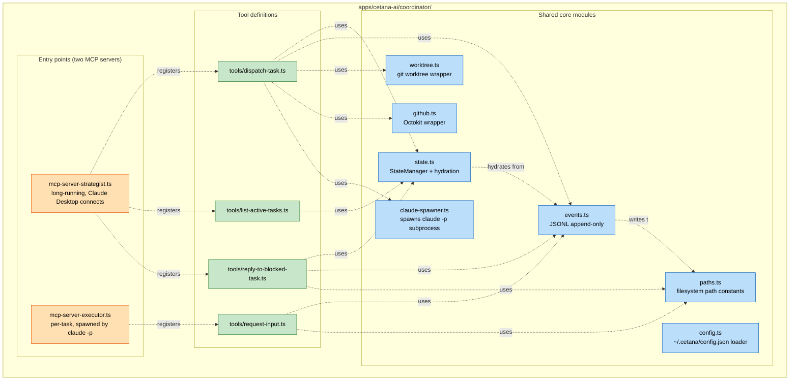
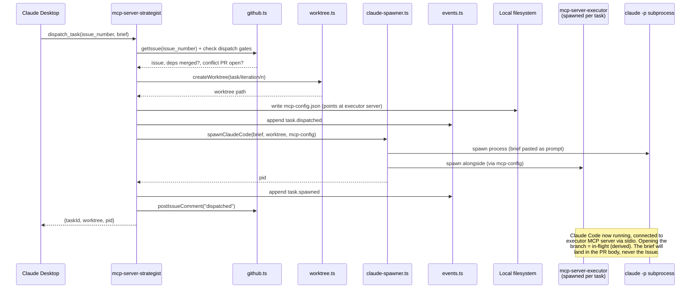
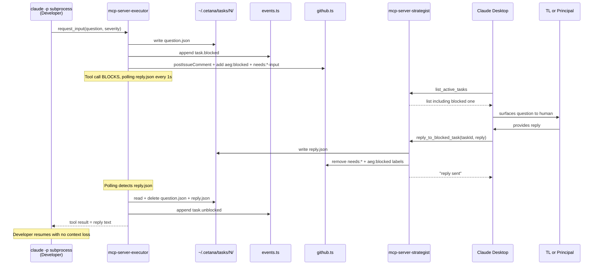
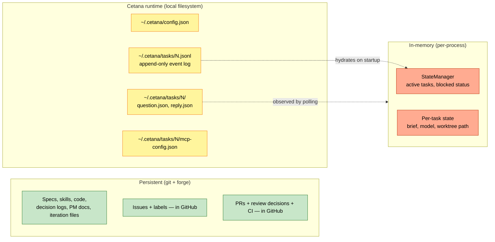

# System architecture diagram — the orchestration tool (Cetana)

Module-level view of the software that **automates** the AEG flow in this repo. **No agents in this diagram** — no roles, just code modules, files, services, and their connections.

> **Scope: this documents Cetana, the *optional* orchestration tool used in this repo — it is NOT the AEG model.** AEG is forge-native and orchestrator-independent: it runs on the **Repo + the Git forge (GitHub)** alone, with local git **worktrees** that need no tool. Everything below labelled "Cetana" — the Coordinator, the MCP servers, the `~/.cetana` runtime, the IPC files — exists **only when Cetana is in use**. Run AEG by hand and none of it is present; the flow is identical (`aeg-manual-flow.md`). Cetana knows AEG; AEG does not know Cetana.

For the agent/process view, see `process-flow.md`. For the prose workflow, see `process.md`. For why Cetana exists, see `apps/cetana-ai/specs/cetana-spec.md`.

---

## Why this diagram exists

When Cetana is running, an agent action like "the Developer escalates" is implemented as a chain of software: a stdio MCP message from a subprocess to its parent's MCP server, which writes a file to a shared directory, which is polled by another process, which writes a label to GitHub. This diagram shows that substrate — the answer to *"if I forgot the role docs and just looked at Cetana's code, what would I see?"* None of it is required by AEG; it is one tool's way of automating the dispatch + escalation slice.

---

## Substrates: what AEG needs vs. what Cetana adds



**What each is for:**

- **Repo** — canonical state: the constitution, specs, skills, code, decision logs, iteration topology files. Survives across machines and time.
- **GitHub (the forge)** — execution state + audit. Issues *are* tasks. PRs gate merges and carry the brief in their body. **Task status is *derived* from Issue/branch/PR/merge state — labels do not carry status** (labels are `tier:*`, `aeg:blocked`, `needs:*-input`). Comments form the audit trail; CI enforces gates.
- **Worktrees** — per-task isolated checkouts on `task/<iteration>/<n>` branches. Plain git; no tool required.
- **Cetana (optional)** — runtime state for the tool that automates dispatch + escalation: config, task event logs, IPC files. Present only when Cetana runs. Nothing canonical depends on it.

---

## The Cetana Coordinator (the orchestration layer)

One Bun package with two MCP server entry points sharing core modules. *(Cetana internals — accurate to this repo's tool.)*



**Why two entry points and not two packages:** the strategist and executor servers expose different tool surfaces but share state semantics, event types, and path conventions. Two entry points in one package keeps the shared code DRY. See `apps/cetana-ai/specs/cetana-decisions.md` D-002.

---

## The complete signal flow on dispatch (Cetana)

What Cetana does when the Principal dispatches from Claude Desktop. *(In the manual flow, the Developer's worktree-first Step 0 does the equivalent and none of this runs.)*



---

## The escalation flow (Cetana implementation)

How Cetana implements AEG's escalation when a Developer blocks. *(Manually, this is a chat message to the TL/Principal; the routing is identical.)*



---

## CI and Archivist (the enforcement layer — AEG-level)

What runs automatically on PR open/merge. This layer is AEG's, not Cetana's — it's GitHub Actions + scripts in the repo.

```mermaid
flowchart TB
    PROpen[PR opened or updated] --> CI[CI: GitHub Actions]

    CI --> Typecheck[Typecheck — tsc --noEmit]
    CI --> Lint[Lint — biome check]
    CI --> Tests[Tests — bun test]
    CI --> VerifyDocs[verify-docs.ts — tier-aware doc check]

    Typecheck --> CIPass{All green?}
    Lint --> CIPass
    Tests --> CIPass
    VerifyDocs --> CIPass

    CIPass -->|Yes| ArchivistAdvisory[Archivist Action — advisory comments]
    CIPass -->|No| Block[PR blocked from merge]

    ArchivistAdvisory --> AdvisoryChecks[related-decision surfacing,<br/>skill staleness, execution-metadata creep,<br/>lock-acknowledgment hints]
    AdvisoryChecks --> Comments[Posts as PR comments — NOT blocking]

    PROpen -.also.-> BriefValid[Brief Validation on the brief]
    BriefValid --> ValidCheck{Brief well-formed?<br/>tier present? structure ok?<br/>Product resolves? no planning fields?}
    ValidCheck -->|Yes| Ready[Dispatchable]
    ValidCheck -->|No| Blocked2[needs:brief-correction]

    Merge[PR merged — auto-closes Issue] --> CloseOut[Archivist close-out]
    CloseOut --> ChangeLog[Append changelog]
    CloseOut --> PerProject[Update per-project state.md<br/>for every project the task listed<br/>(now.md retired — D-057)]
    CloseOut --> IndexRegen[Regenerate docs-index.md]
    CloseOut --> SeqValid[Validate D-### sequence within each log]
    CloseOut --> Orphans[Flag orphaned branches + worktrees]

    Daily[Daily cron] --> DriftCheck[Archivist drift check]
    DriftCheck --> StaleSpec[Flag specs older than referenced code]
    DriftCheck --> MetaCreep[Flag execution metadata in iteration files]
    DriftCheck --> DriftIssue[Open Issue type:drift-detected if found]

    classDef ciNode fill:#ffe0b2,stroke:#e65100,color:#000
    classDef archivistNode fill:#e1bee7,stroke:#6a1b9a,color:#000
    classDef blockNode fill:#ffcdd2,stroke:#b71c1c,color:#000
    classDef passNode fill:#c8e6c9,stroke:#2e7d32,color:#000
    classDef neutralNode fill:#f5f5f5,stroke:#424242,color:#000

    class CI,Typecheck,Lint,Tests,VerifyDocs ciNode
    class ArchivistAdvisory,AdvisoryChecks,Comments,BriefValid,CloseOut,ChangeLog,PerProject,IndexRegen,SeqValid,Orphans,DriftCheck,StaleSpec,MetaCreep,DriftIssue archivistNode
    class Block,Blocked2 blockNode
    class Ready,Merge passNode
    class PROpen,CIPass,ValidCheck,Daily neutralNode
```

**Two enforcement layers:** CI (blocking) — typecheck, lint, tests, verify-docs; if any fail the PR can't merge. Archivist (advisory) — synthesis hints, related-decision surfacing, drift detection, the anti-regression flags (execution metadata in iteration files); posts comments and opens drift issues but never blocks. Hard gates for the mechanically verifiable; advisory for what needs judgment.

---

## State storage and where it lives (Cetana runtime)



**Persistence guarantees:** Persistent survives anything short of repo deletion (git + GitHub). Cetana runtime survives process restarts (StateManager rehydrates from JSONL); lost on machine reinstall, recoverable from `~/.cetana` backup. In-memory is lost on termination, always rebuildable from JSONL. A crashed Coordinator restarts and resumes correctly — the JSONL log is the tool's source of truth, while the *task's* status remains derived from the forge regardless of tool state.

---

## Where the operational model files live (AEG file map)

Mapping the AEG docs to the substrate. *(This is AEG's own layout — no tool involved.)*

```mermaid
flowchart TB
    subgraph PM["aeg-root/ (operational model — root only) + aeg-project/ (living state)"]
        Coord[aeg-root/coordination.md<br/>session start protocol]
        Process[aeg-root/process.md<br/>workflow walkthrough]
        Manual[aeg-root/aeg-manual-flow.md<br/>running the flow by hand]
        StateMach[aeg-root/state-machine.md<br/>artifacts, mutations, hierarchy]
        Decisions[aeg-project/decisions.md — global decision log]
        StateNow[aeg-project/state.md — non-derivable operational facts<br/>(now.md retired D-057 — active state from forge)]
        Iterations[aeg-root/iterations/ — README + per-iteration<br/>topology files the plan]
        Projects[aeg-root/projects.md — project registry]
        Reviewer[aeg-root/reviewer-prompt.md — for stateless AIs]
        RatQueue[aeg-project/ratification-queue.md — append-only]
        Think[aeg-project/thinking.md — working memory]
        Diagrams[aeg-root/diagrams/ — process-flow + system-architecture]
        Roles[aeg-root/roles/ — principal, team-leader, planner,<br/>developer, reviewer, security, archivist]
    end

    subgraph Skills[".claude/skills/ (technical + meta)"]
        BriefSkill[brief-authoring/SKILL.md]
        OtherSkills[tech skills: auth, database,<br/>ui, engine/adapter/teams, etc.]
    end

    subgraph Specs["apps/*/specs/ (project-specific)"]
        ProjectSpec[<project>-spec.md]
        ProjectDec[<project>-decisions.md]
        Backlog[<project>-backlog.md — held/future, out of flow]
    end

    subgraph Tooling["packages/aeg-core/bin/ + .github/workflows/"]
        VerifyScript[packages/aeg-core/bin/verify-docs.ts]
        ArchivistFlow[.github/workflows/archivist.yml]
    end

    PM -.governs.-> Specs
    PM -.references.-> Skills
    Skills -.applied during.-> Specs
    Tooling -.enforces.-> Specs
    Tooling -.enforces.-> Skills
    Tooling -.enforces.-> PM

    classDef pmNode fill:#bbdefb,stroke:#1565c0,color:#000
    classDef skillsNode fill:#c8e6c9,stroke:#2e7d32,color:#000
    classDef specsNode fill:#ffe0b2,stroke:#e65100,color:#000
    classDef toolingNode fill:#e1bee7,stroke:#6a1b9a,color:#000

    class Coord,Process,Manual,StateMach,Decisions,StateNow,Iterations,Projects,Reviewer,RatQueue,Think,Diagrams,Roles pmNode
    class BriefSkill,OtherSkills skillsNode
    class ProjectSpec,ProjectDec,Backlog specsNode
    class VerifyScript,ArchivistFlow toolingNode
```

---

## How a single piece of work touches every layer

A concrete example: implementing a new Vāda team YAML (a Tier 1, single-project task).

```mermaid
flowchart LR
    A[Developer checks dispatch gates,<br/>reads brief + skills + spec]
    A --> B[Writes new YAML in apps/vada-ai/yamls/]
    B --> C[Updates vada-spec.md catalog table]
    C --> D[Adds tests verifying YAML loads]
    D --> E[Runs verify-docs.ts locally]
    E --> F[Opens PR — brief in body, Closes-N]
    F --> G[CI: typecheck/lint/tests/verify-docs]
    G --> H[code-reviewer pass → security pass]
    H --> I[Principal code review]
    I --> J[TL spec review]
    J --> K[Principal merge — Issue auto-closes]
    K --> L[Archivist close-out:<br/>changelog, per-project state.md, docs-index]

    classDef devNode fill:#c8e6c9,stroke:#2e7d32,color:#000
    classDef ciNode fill:#ffe0b2,stroke:#e65100,color:#000
    classDef revNode fill:#d1c4e9,stroke:#4527a0,color:#000
    classDef archivistNode fill:#e1bee7,stroke:#6a1b9a,color:#000
    classDef principalNode fill:#f8bbd0,stroke:#ad1457,color:#000
    classDef tlNode fill:#bbdefb,stroke:#1565c0,color:#000

    class A,B,C,D,E,F devNode
    class G ciNode
    class H revNode
    class I,K principalNode
    class J tlNode
    class L archivistNode
```



This is Tier 1: no Type 1 decisions, no escalation. The status is never written — it moves `todo → in-flight` when the branch opens, `→ in-review` when the PR opens, `→ merged` on merge, all derived. For a Tier 3 task, additional artifacts get touched (`decisions.md` entry, `state.md`, the iteration file is *not* touched for status, a Lock entry if irreversible) and the merge happens during a ratification window.

---

## What this diagram is not

This is the static structure of the optional tool plus the AEG file/enforcement layout. It does **not** show: the lifecycle of work (`process-flow.md`), who does what when (`roles/*.md`), why Cetana exists (`apps/cetana-ai/specs/cetana-spec.md`), or the reasoning behind the architecture (`cetana-decisions.md`). And it is **not the AEG model** — AEG is forge-native; remove Cetana and the flow is unchanged.

---

## Diagrams are documentation

This diagram is part of the canonical operational model. Changes to Cetana's architecture or the AEG file/enforcement layout require updating this diagram in the same PR. Out-of-sync diagrams are spec drift and will be flagged by the Archivist. Where a diagram and the prose disagree, the prose is canonical.
