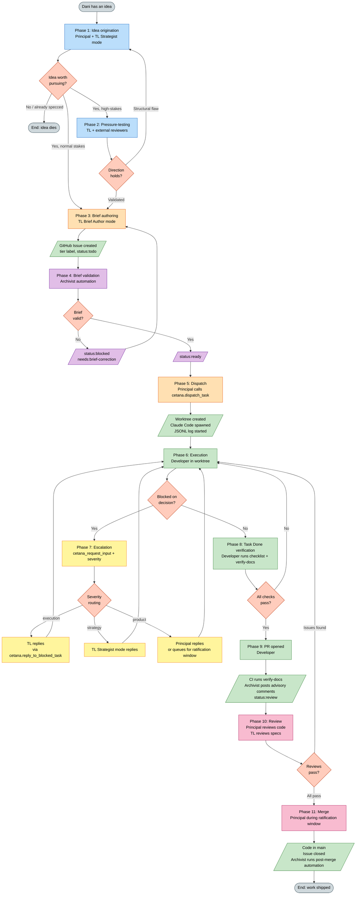
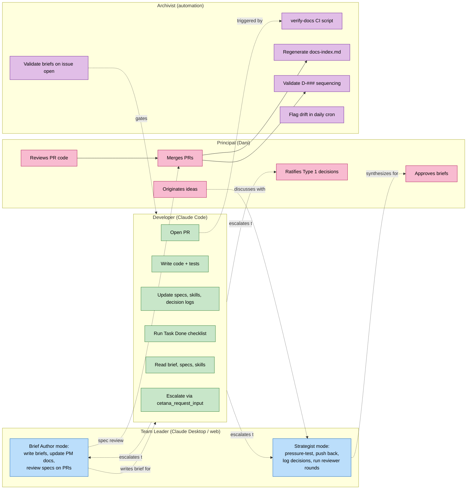
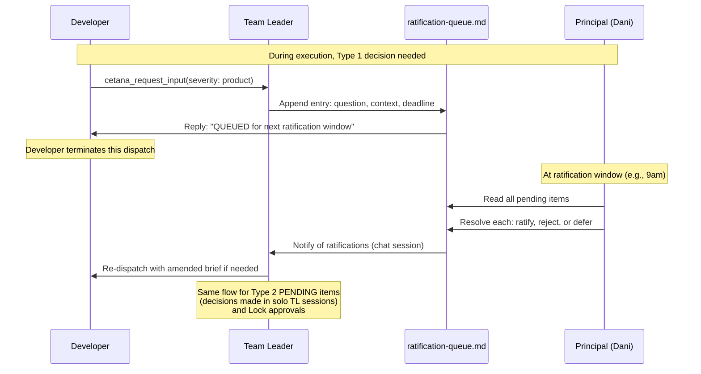
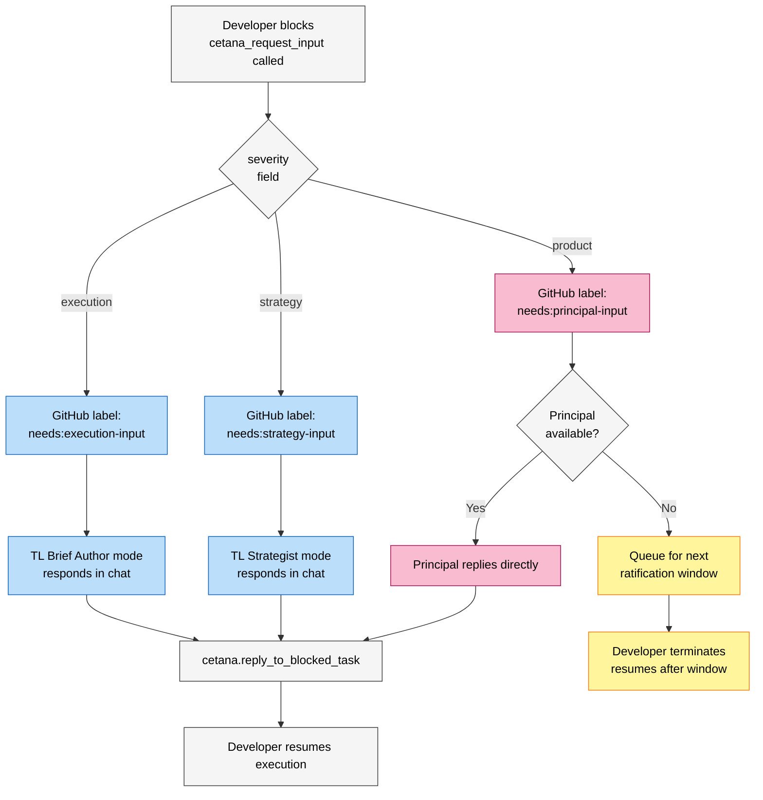
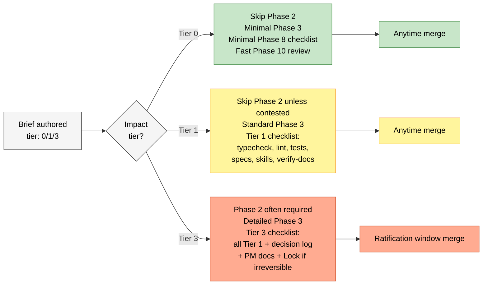

# Process flow diagram

Visual representation of the eleven-phase workflow described in `process.md`. This shows actors, artifacts, gates, and decision points.

For the prose walkthrough, see `process.md`.
For the static system architecture (no agents, just code modules), see `system-architecture.md`.

---

## High-level flow

**Color coding:**
- Blue: TL Strategist mode work — thinking, pressure-testing
- Orange: TL Brief Author mode + Principal dispatch — formalization
- Purple: Archivist automation (validation, indexing, advisory)
- Green: Developer work + artifacts produced during execution
- Yellow: Escalation routing
- Pink: Principal + TL review and merge
- Grey: Start/end states
- Salmon: Decision gates

All boxes use dark text on light backgrounds for readability.

---

## Actor responsibilities by phase

---

## Artifact lifecycle

What gets created or mutated as work flows through the phases.

```mermaid
flowchart TD
    subgraph Phase1["Phase 1: Idea"]
        Conv1[Conversation log<br/>ephemeral]
        Think1[thinking.md<br/>updated if open tensions]
        Dec1[decisions.md<br/>D-### entry if commitment made]
    end

    subgraph Phase3["Phase 3: Brief"]
        Issue[GitHub Issue<br/>with brief + tier label]
    end

    subgraph Phase5["Phase 5: Dispatch"]
        Worktree[Worktree:<br/>~/code/atta/.worktrees/issue-N/]
        JSONL[JSONL log:<br/>~/.cetana/tasks/taskId.jsonl]
        IPC[IPC dir:<br/>~/.cetana/tasks/taskId/]
        Comment1[GitHub comment:<br/>dispatch confirmed]
    end

    subgraph Phase6["Phase 6: Execution"]
        Code[Code commits on feat branch]
        Tests[Tests added/updated]
        Specs[Specs created/updated<br/>per impact tier]
        Skills[Skills created/updated<br/>per impact tier]
        DecLog[Decision log entries<br/>if architecture changed]
        Progress[task.progress events<br/>in JSONL]
    end

    subgraph Phase7["Phase 7: Escalation (optional)"]
        Question[question.json<br/>+ task.blocked event]
        Reply[reply.json<br/>+ task.unblocked event]
        QueueEntry[ratification-queue.md entry<br/>if Type 1]
    end

    subgraph Phase9["Phase 9: PR"]
        PR[Pull Request<br/>with body, description]
        DocsIndex[docs-index.md updated<br/>if files added/removed]
        AdvisoryComment[Archivist advisory comments]
    end

    subgraph Phase11["Phase 11: Merge"]
        Main[Code in main]
        Closed[Issue closed,<br/>label: status:merged]
        Completed[task.completed event]
    end

    subgraph PostMerge["Post-merge (automated)"]
        IndexRegen[docs-index.md regenerated]
        SeqValid[D-### sequence validated]
        DriftCron[Drift cron output]
    end

    Phase1 --> Phase3
    Phase3 --> Phase5
    Phase5 --> Phase6
    Phase6 -.optional.-> Phase7
    Phase7 -.resumes.-> Phase6
    Phase6 --> Phase9
    Phase9 --> Phase11
    Phase11 --> PostMerge

    classDef phaseBox fill:#f5f5f5,stroke:#424242,color:#000
    class Conv1,Think1,Dec1,Issue,Worktree,JSONL,IPC,Comment1,Code,Tests,Specs,Skills,DecLog,Progress,Question,Reply,QueueEntry,PR,DocsIndex,AdvisoryComment,Main,Closed,Completed,IndexRegen,SeqValid,DriftCron phaseBox
```

---

## Ratification window flow

How Type 1 decisions, Tier 3 merges, and Lock approvals batch through governance windows.

---

## Severity routing

How `cetana_request_input` escalations route based on severity.

---

## Tier-driven gating

Which gates apply to work depending on impact tier.

---

## How to read these diagrams

**The high-level flow** is the canonical map of work. If you're unsure where a piece of work is in the system, find it on this diagram.

**The actor responsibilities diagram** is for understanding who does what. If you're starting a new Claude session, your role determines which boxes are yours.

**The artifact lifecycle diagram** is for understanding what gets created when. If you're auditing a finished task, this tells you what artifacts should exist.

**The ratification window flow** is for understanding governance cadence. Critical for Tier 3 work and Type 1 decisions.

**The severity routing diagram** is for understanding what happens when a Developer blocks. Determines who responds and how.

**The tier-driven gating diagram** is for understanding what discipline applies to a given task. Different tiers, different ceremony.

---

## Diagrams are documentation

These diagrams are part of the canonical operational model. Updates to the process require updates to both `process.md` and these diagrams in the same PR. Out-of-sync diagrams are spec drift.
