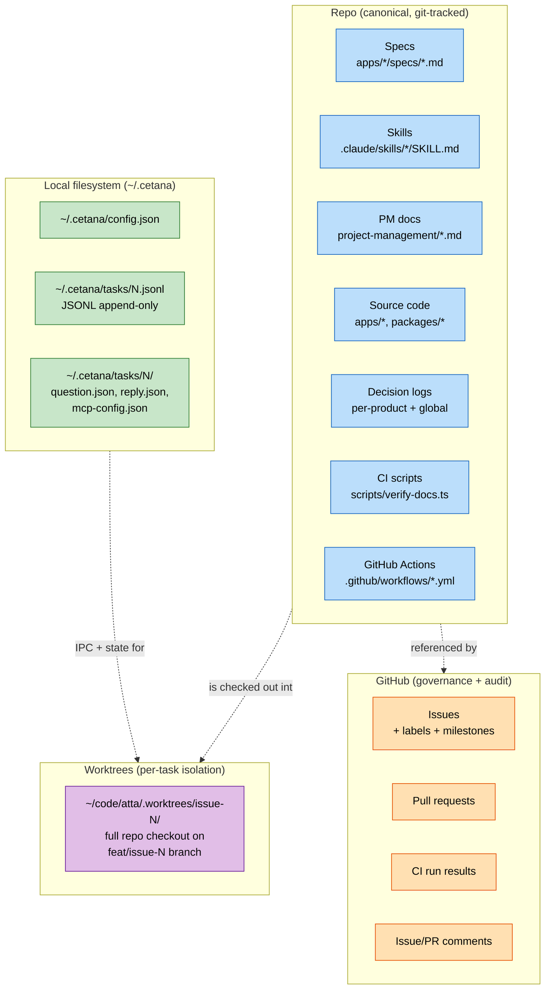
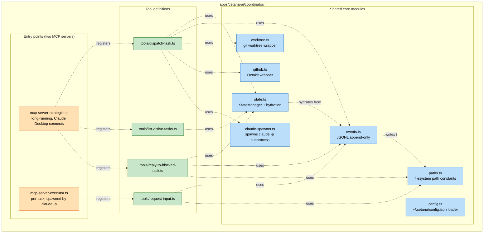
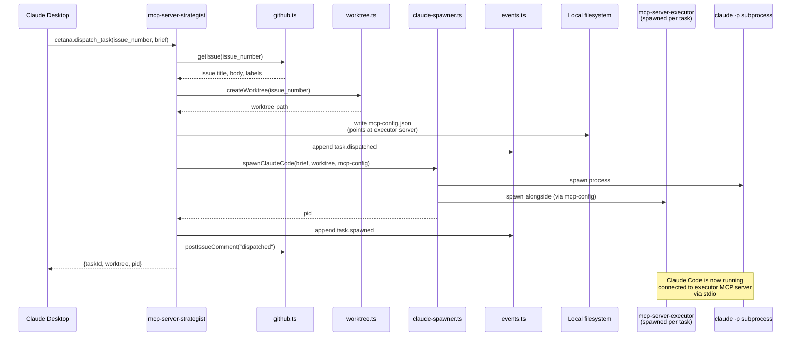
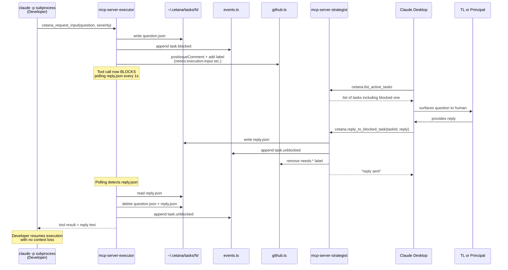
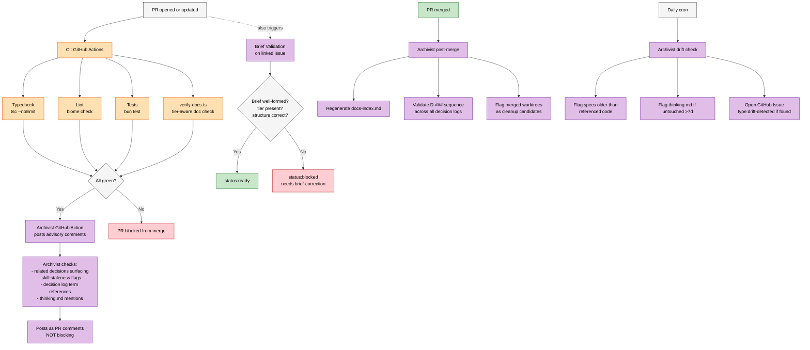
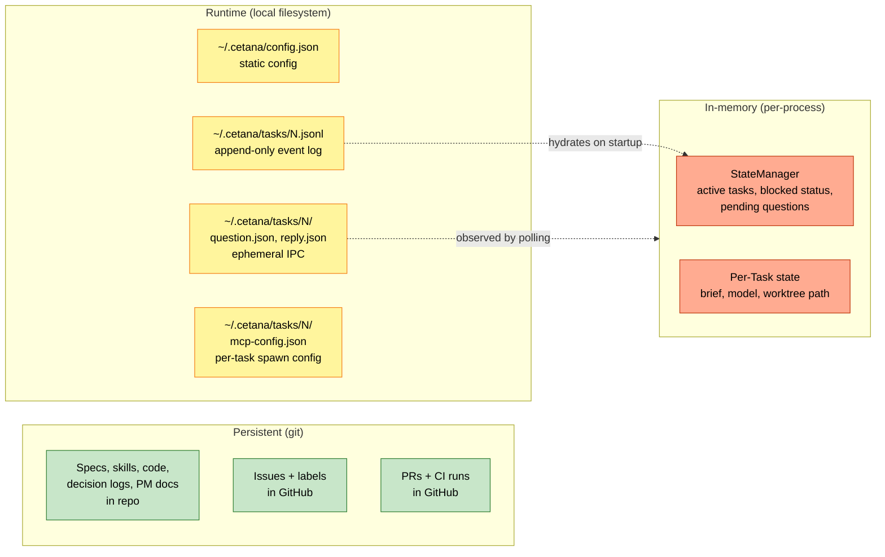
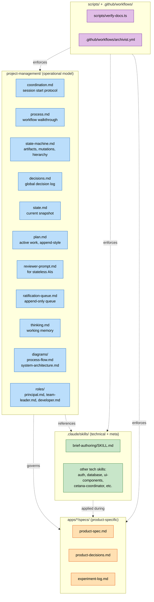

# System architecture diagram

Module-level view of the software pieces that implement the Atta operational model. **No agents in this diagram.** No roles. Just code modules, files, services, and the connections between them.

For the agent/process view, see `process-flow.md`.
For the prose explanation of the workflow, see `process.md`.

---

## Why this diagram exists

The operational model is implemented across multiple software components: the Cetana Coordinator (Bun service), the executor's MCP server (spawned per task), the verification CI script, the Archivist GitHub Actions, the GitHub Issues system, the JSONL filesystem layer, and the repo files themselves.

When agents talk, they're using these modules as substrate. When a Developer "calls `cetana_request_input`," what's actually happening is a stdio MCP message from a subprocess to its parent's MCP server which writes a file to a shared directory which is polled by another process which writes a label to GitHub.

This diagram shows the substrate. It's the answer to: *if I forgot all the role docs and just looked at the code, what would I see?*

---

## Top-level: the four substrates

The operational model runs across four substrates. Each owns a different kind of state.

**The substrates and what they're for:**

- **Repo** — canonical state. The constitution, the specs, the skills, the code, the decision logs. Anything that survives across machines and across time.
- **GitHub** — governance + audit. Issues track tasks. PRs gate merges. Labels carry status. Comments form the audit trail. CI enforces gates.
- **Local filesystem** — runtime state. Configuration, task event logs, IPC files between MCP servers. Survives process restarts but not machine reinstalls.
- **Worktrees** — per-task isolated workspaces. Each running task has its own checkout. Multiple parallel tasks don't collide.

---

## The Cetana Coordinator (the orchestration layer)

The Coordinator is one Bun package with two MCP server entry points. They share core modules.

**Why two entry points and not two packages:** the strategist and executor servers expose different tool surfaces but share the same state semantics, event types, and path conventions. Two entry points in one package keeps the shared code DRY without forcing workspace gymnastics. See `apps/cetana-ai/specs/cetana-decisions.md` D-002.

---

## The complete signal flow on dispatch

What actually happens when Principal calls `cetana.dispatch_task` from Claude Desktop.

---

## The escalation flow (when Developer blocks)

What happens when a Developer calls `cetana_request_input`.

---

## CI and Archivist (the enforcement layer)

What runs automatically when a PR is opened or merged.

**The two enforcement layers:**

- **CI (blocking):** typecheck, lint, tests, verify-docs. If any fail, the PR cannot merge.
- **Archivist (advisory):** synthesis hints, related-decision surfacing, drift detection. Posts comments on PRs and opens issues for drift, but never blocks merge.

This split is deliberate. Hard gates for things that are mechanically verifiable (does the code compile? did the right files get updated?). Advisory for things that require judgment (is this decision related to D-042? is this spec describing the current behavior?).

---

## State storage and where it lives

Where each kind of state actually lives on disk.

**Persistence guarantees:**

- **Persistent:** survives anything short of repo deletion. Git history preserves it.
- **Runtime:** survives process restarts (StateManager rehydrates from JSONL on startup). Lost on machine reinstall — recoverable from `~/.cetana` backup if needed.
- **In-memory:** lost on process termination. Always rebuildable from the JSONL log.

This means a crashed Coordinator can be restarted and will resume tracking active tasks correctly. The JSONL log is the source of truth.

---

## Where the operational model files live

Mapping the operational model docs to the substrate.

---

## How a single piece of work touches every layer

A concrete example: implementing a new Vāda team YAML.

```mermaid
flowchart LR
    A[Developer reads:<br/>brief, vada-yaml-authoring skill,<br/>vada-product-spec.md]
    A --> B[Developer writes:<br/>new YAML in apps/vada-ai/yamls/]
    B --> C[Developer updates:<br/>vada-product-spec.md<br/>YAMLs catalog table]
    C --> D[Developer adds tests<br/>verifying YAML loads]
    D --> E[Developer runs:<br/>verify-docs.ts locally]
    E --> F[Developer opens PR]
    F --> G[CI: typecheck/lint/tests/verify-docs]
    G --> H[Archivist: advisory comments]
    H --> I[Principal: code review]
    I --> J[TL: spec review]
    J --> K[Principal: merge]
    K --> L[Archivist: regenerate<br/>docs-index.md]

    classDef devNode fill:#c8e6c9,stroke:#2e7d32,color:#000
    classDef ciNode fill:#ffe0b2,stroke:#e65100,color:#000
    classDef archivistNode fill:#e1bee7,stroke:#6a1b9a,color:#000
    classDef principalNode fill:#f8bbd0,stroke:#ad1457,color:#000
    classDef tlNode fill:#bbdefb,stroke:#1565c0,color:#000

    class A,B,C,D,E,F devNode
    class G ciNode
    class H,L archivistNode
    class I,K principalNode
    class J tlNode
```

This is a Tier 1 task. No Type 1 decisions, no escalation. Six artifacts touched (YAML, spec, tests, verify-docs run, PR, docs-index). Two reviewers (Principal for code, TL for spec). One automated post-merge step.

For a Tier 3 task, additional artifacts get touched: `decisions.md` entry, `state.md` update, possibly `plan.md` update, possibly a Lock entry. And the merge happens during a ratification window rather than anytime.

---

## What this diagram is not

This is the static structure. It does **not** show:

- The lifecycle of a piece of work (see `process-flow.md`)
- Who does what when (see `roles/*.md`)
- Why each module exists (see `apps/cetana-ai/specs/cetana-spec.md` and `cetana-decisions.md`)
- The reasoning behind the architecture (see `apps/cetana-ai/specs/cetana-experiment-log.md`)

If you're trying to understand how something flows, this is the wrong diagram. If you're trying to understand what software exists and how the pieces connect, this is the right one.

---

## Diagrams are documentation

This diagram is part of the canonical operational model. Updates to the architecture require updates to this diagram in the same PR. Out-of-sync architecture diagrams are spec drift and will be flagged by the Archivist.
